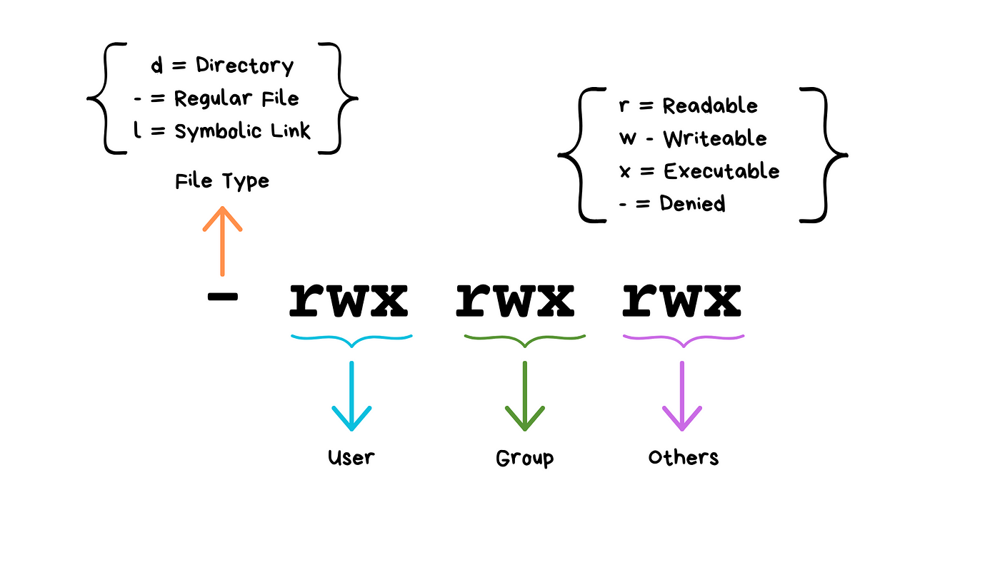
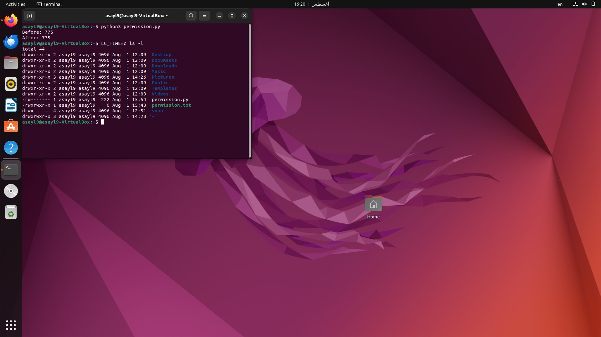

# Linux File Permissions 

##  Task Objective  
Understand Linux file permissions and create a flowchart to explain them. Then, write a Python script that uses the `chmod` command to change the permissions of a file to `rwxrwxr-x` (octal `0775`).

---

##  File Permissions Overview  

The image below provides a simplified explanation of how file permissions work in Linux:

  
🔗 [Full explanation from Qirolab](https://qirolab.com/posts/understanding-linux-file-permissions-and-ownership)

### Meaning of Permission Characters:
- `r` = Readable  
- `w` = Writable  
- `x` = Executable  
- `-` = No permission  

### Segments:
- **User**: The file owner  
- **Group**: The file's group  
- **Others**: All other users  

Example:  
`-rwxrwxr-x` means:
- Owner: read, write, execute ✅  
- Group: read, write, execute ✅  
- Others: read, execute ❌ write

---

##  Python Script (`permission.py`)

```python
import os
import stat

filename = "permission.txt"

# Get current permissions
before = oct(os.stat(filename).st_mode)[-3:]
print(f"Before: {before}")

# Change permissions to rwxrwxr-x (0775)
os.chmod(filename, 0o775)

# Get permissions after change
after = oct(os.stat(filename).st_mode)[-3:]
print(f"After: {after}") 
```

## Terminal Output Screenshots



## Flowchart

               ┌────────────┐
               │   Start    │
               └────┬───────┘
                    │
                    ▼
     ┌──────────────────────────────┐
     │ Use os.stat to get current   │
     │ permissions                  │
     └──────────────┬───────────────┘
                    │
                    ▼
       ／￣￣￣￣￣￣￣￣￣￣￣￣￣＼
      ｜  Print "Before" permissions  ｜
       ＼＿＿＿＿＿＿＿＿＿＿＿＿＿／
                    │
                    ▼
     ┌──────────────────────────────┐
     │ Use os.chmod to apply 0775   │
     └──────────────┬───────────────┘
                    │
                    ▼
     ┌────────────────────────────────────────────┐
     │ Use os.stat again to get updated           │
     │ permissions                                │
     └──────────────┬─────────────────────────────┘
                    │
                    ▼
       ／￣￣￣￣￣￣￣￣￣￣￣￣￣＼
      ｜  Print "After" permissions   ｜
       ＼＿＿＿＿＿＿＿＿＿＿＿＿＿／
                    │
                    ▼
               ┌────────────┐
               │    End     │
               └────────────┘


